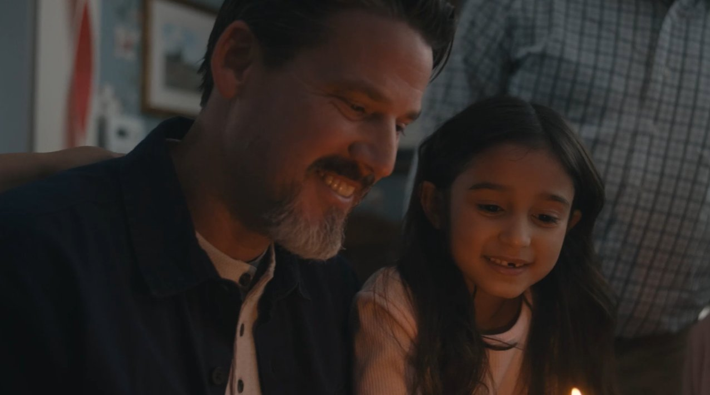
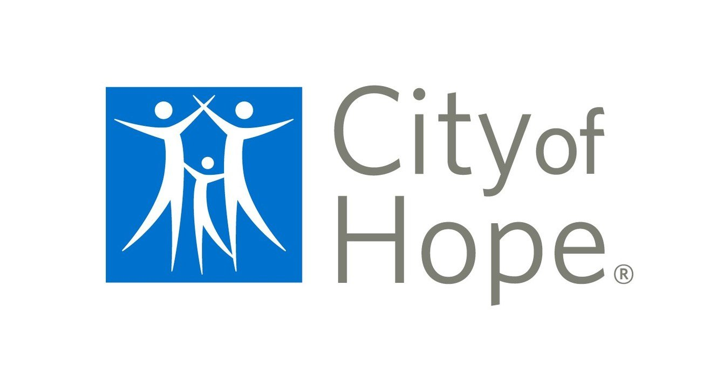
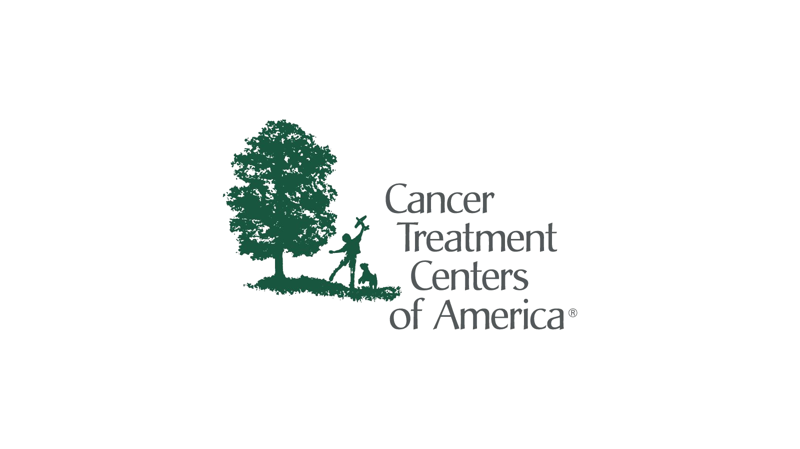
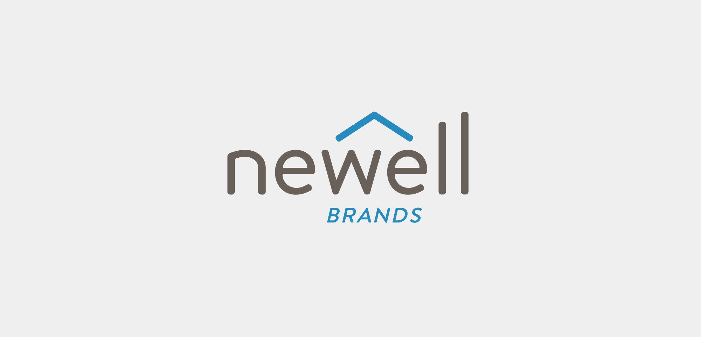
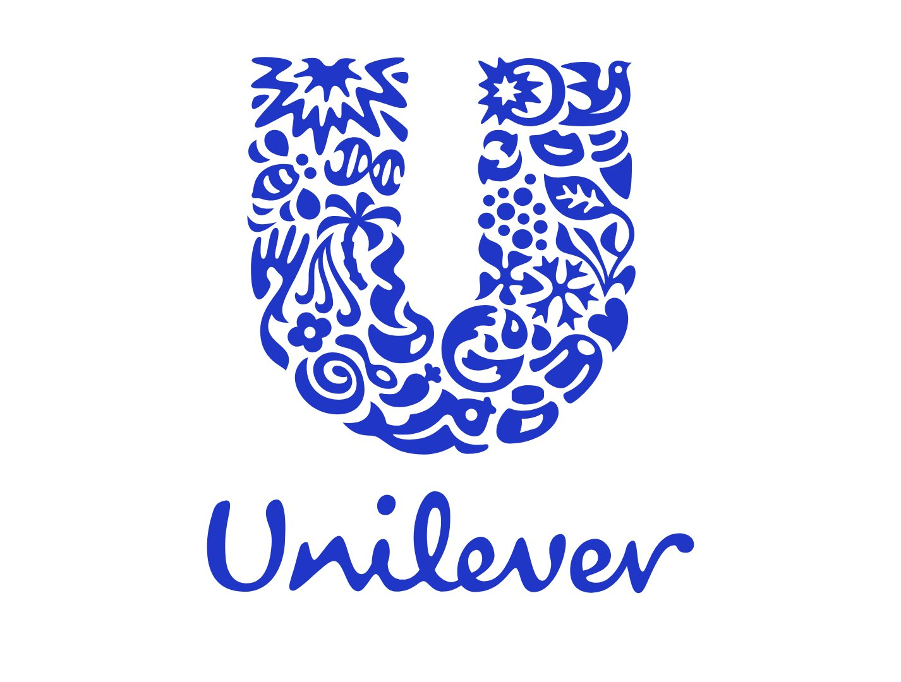
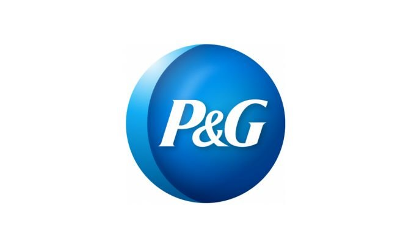
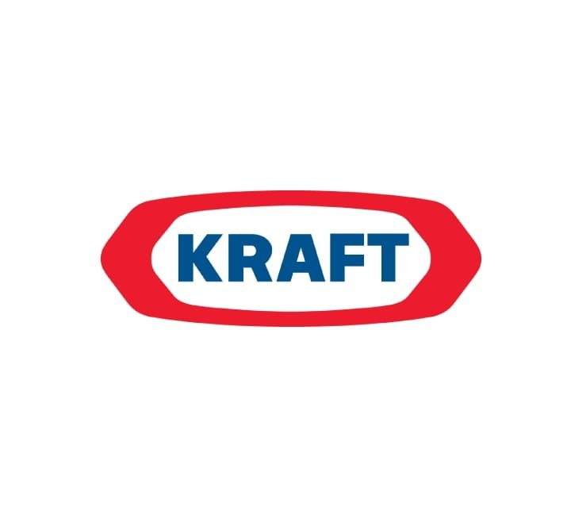

<!DOCTYPE html>
<html lang="en">
<head>
  <meta charset="UTF-8">
  <meta name="viewport" content="width=device-width, initial-scale=1.0">
  <title>Lenna Conley Jasuja — Brand Marketing & Creative Leader</title>
  <meta name="description" content="Lenna Conley Jasuja is a brand marketing and creative leader with Fortune 100 experience spanning healthcare, CPG, and durable goods.">
  <link rel="preconnect" href="https://fonts.googleapis.com">
  <link rel="preconnect" href="https://fonts.gstatic.com" crossorigin>
  <link href="https://fonts.googleapis.com/css2?family=Cormorant+Garamond:ital,wght@0,400;0,500;0,600;1,400;1,500&family=Outfit:wght@300;400;500;600&display=swap" rel="stylesheet">
  
</head>
<body>

  <!-- NAV -->
  <nav id="nav">
    <a href="#" class="logo">Lenna Conley Jasuja</a>
    <button class="hamburger" onclick="document.querySelector('nav ul').classList.toggle('open')" aria-label="Menu">
      
    </button>
    <ul>
      <li><a href="#about">About</a></li>
      <li><a href="#work">Work</a></li>
      <li><a href="#career">Career</a></li>
      <li><a href="#contact">Contact</a></li>
    </ul>
  </nav>

  <!-- HERO -->
  <section class="hero">
    

      <h1>Building brands that <em>move</em> people</h1>
      
I'm Lenna Conley Jasuja — a brand marketing and creative leader who combines Fortune 100 discipline with purpose-driven storytelling. I build teams that turn complex value into campaigns people actually feel while delivering measurable growth.

      

        City of Hope
        CTCA
        Newell Brands
        Unilever
        Procter &amp; Gamble
        Kraft General Foods
      

    

    

      

        
      

    

  </section>

  <!-- ABOUT -->
  <section class="about" id="about">
    

      About
      <h2 class="section-heading">Strategy meets storytelling</h2>
      

        

          
I'm a cross-disciplined marketer with a track record of building and elevating brands at the intersection of strategy, creativity, and purpose. Leading brand strategy in oncology sharpened my ability to market with both rigor and empathy — translating complex clinical value into narratives that move patients to act.

          
At City of Hope, a top-10 NCI-designated cancer system, I led enterprise brand marketing and creative across 40+ locations, unifying City of Hope and Cancer Treatment Centers of America into a national brand post-acquisition.

        

        

          
Before healthcare, I spent nearly two decades in CPG at Newell Brands, leading marketing for Crock-Pot, Mr. Coffee, Calphalon, and Oster — launching over 100 products and driving both retail and DTC growth. My career began in brand activation at Procter &amp; Gamble and Unilever, where I built the discipline of consumer-led, data-driven marketing.

          

            <a href="https://www.linkedin.com/in/lennaconley/" target="_blank" rel="noopener">
              LinkedIn
              <svg xmlns="http://www.w3.org/2000/svg" viewBox="0 0 24 24" fill="none" stroke="currentColor" stroke-width="2" stroke-linecap="round" stroke-linejoin="round"><line x1="7" y1="17" x2="17" y2="7"></line><polyline points="7 7 17 7 17 17"></polyline></svg>
            </a>
          

        

      

    

  </section>

  <!-- WORK -->
  <section class="work" id="work">
    

      Campaign Work
      <h2 class="section-heading">Selected creative</h2>
      

        <a href="https://michaelharkins.slateapp.com/showreel/view/5ec831bbeb48d" target="_blank" rel="noopener" class="work-card" style="text-decoration:none; color:inherit;">
          

            
            

              

                <svg viewBox="0 0 24 24"><polygon points="5,3 19,12 5,21"></polygon></svg>
              

            

          

          

            
Director's Reel — Michael Harkins

            <h3>City of Hope &amp; CTCA Campaigns</h3>
            
National TV spots including "Hope Is Here," "One Call," and "Driven" — produced through the in-house Health Studios team.

            Watch reel <svg xmlns="http://www.w3.org/2000/svg" viewBox="0 0 24 24" fill="none" stroke="currentColor" stroke-width="2" stroke-linecap="round" stroke-linejoin="round"><line x1="5" y1="12" x2="19" y2="12"></line><polyline points="12 5 19 12 12 19"></polyline></svg>
          

        </a>

        <a href="https://www.matthamill.com/" target="_blank" rel="noopener" class="work-card" style="text-decoration:none; color:inherit;">
          

            
            

              

                <svg viewBox="0 0 24 24"><polygon points="5,3 19,12 5,21"></polygon></svg>
              

            

          

          

            
Producer/Editor — Matt Hamill

            <h3>City of Hope Brand Films</h3>
            
"Driven," "This is City of Hope," patient stories, and Walk for Hope — editorial and documentary content produced in-house.

            View work <svg xmlns="http://www.w3.org/2000/svg" viewBox="0 0 24 24" fill="none" stroke="currentColor" stroke-width="2" stroke-linecap="round" stroke-linejoin="round"><line x1="5" y1="12" x2="19" y2="12"></line><polyline points="12 5 19 12 12 19"></polyline></svg>
          

        </a>

      

    

  </section>

  <!-- IMPACT -->
  <section class="impact">
    

      Impact
      <h2 class="section-heading">Numbers that matter</h2>
      

        

          
6,000+

          
Projects delivered annually at City of Hope

        

        

          
26%

          
Increase in qualified funnel leads via SEO/content

        

        

          
$550K

          
Annual vendor savings through in-house production

        

        

          
40+

          
Locations unified under one brand system

        

      

    

  </section>

  <!-- CAREER -->
  <section class="career" id="career">
    

      Career
      <h2 class="section-heading">Where I've built</h2>
      

        
        
        
        
        
        
      

    

  </section>

  <!-- CONTACT -->
  <footer id="contact">
    

      Get in Touch
      <h2 class="section-heading">Let's talk</h2>
      
Open to conversations about brand leadership, creative strategy, and the next thing worth building.

      

        <a href="mailto:lennaconley@gmail.com">
          <svg xmlns="http://www.w3.org/2000/svg" viewBox="0 0 24 24" fill="none" stroke="currentColor" stroke-width="2" stroke-linecap="round" stroke-linejoin="round"><path d="M4 4h16c1.1 0 2 .9 2 2v12c0 1.1-.9 2-2 2H4c-1.1 0-2-.9-2-2V6c0-1.1.9-2 2-2z"></path><polyline points="22,6 12,13 2,6"></polyline></svg>
          Email
        </a>
        <a href="https://www.linkedin.com/in/lennaconley/" target="_blank" rel="noopener">
          <svg xmlns="http://www.w3.org/2000/svg" viewBox="0 0 24 24" fill="none" stroke="currentColor" stroke-width="2" stroke-linecap="round" stroke-linejoin="round"><path d="M16 8a6 6 0 0 1 6 6v7h-4v-7a2 2 0 0 0-2-2 2 2 0 0 0-2 2v7h-4v-7a6 6 0 0 1 6-6z"></path><rect x="2" y="9" width="4" height="12"></rect><circle cx="4" cy="4" r="2"></circle></svg>
          LinkedIn
        </a>
        <a href="tel:5613069699">
          <svg xmlns="http://www.w3.org/2000/svg" viewBox="0 0 24 24" fill="none" stroke="currentColor" stroke-width="2" stroke-linecap="round" stroke-linejoin="round"><path d="M22 16.92v3a2 2 0 0 1-2.18 2 19.79 19.79 0 0 1-8.63-3.07 19.5 19.5 0 0 1-6-6 19.79 19.79 0 0 1-3.07-8.67A2 2 0 0 1 4.11 2h3a2 2 0 0 1 2 1.72 12.84 12.84 0 0 0 .7 2.81 2 2 0 0 1-.45 2.11L8.09 9.91a16 16 0 0 0 6 6l1.27-1.27a2 2 0 0 1 2.11-.45 12.84 12.84 0 0 0 2.81.7A2 2 0 0 1 22 16.92z"></path></svg>
          561.306.9699
        </a>
      

      

        &copy; 2026 Lenna Conley Jasuja. All rights reserved.
      

    

  </footer>

  

</body>
</html>
